# Sol-itaire Site Map Diagram

> Visual representation of the Sol-itaire platform architecture and navigation structure.

## System Architecture Overview

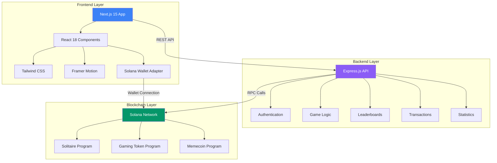

## Frontend Route Structure

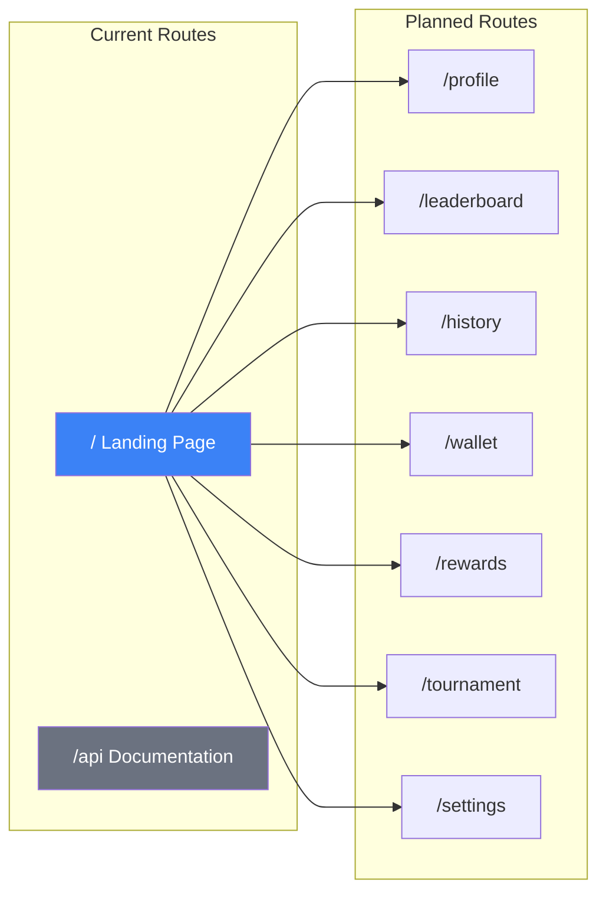

## Landing Page States

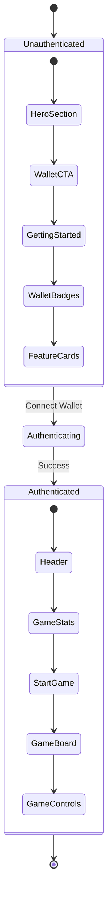

## Backend API Structure

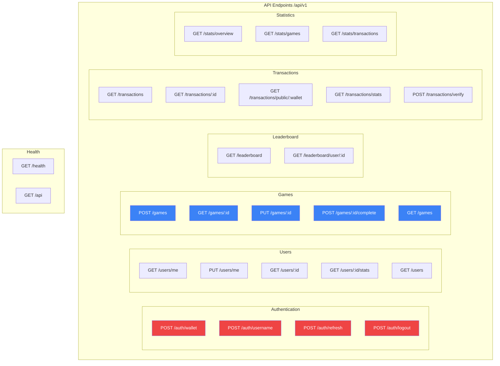

## Smart Contract Architecture

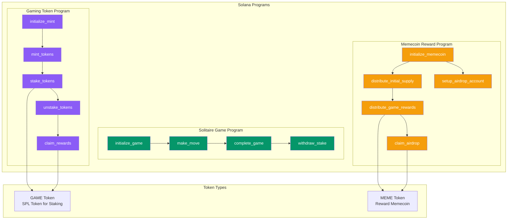

## User Flow: Onboarding

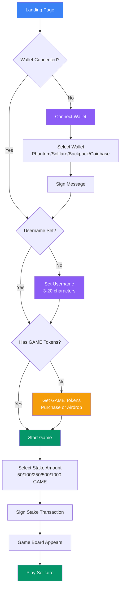

## User Flow: Gameplay

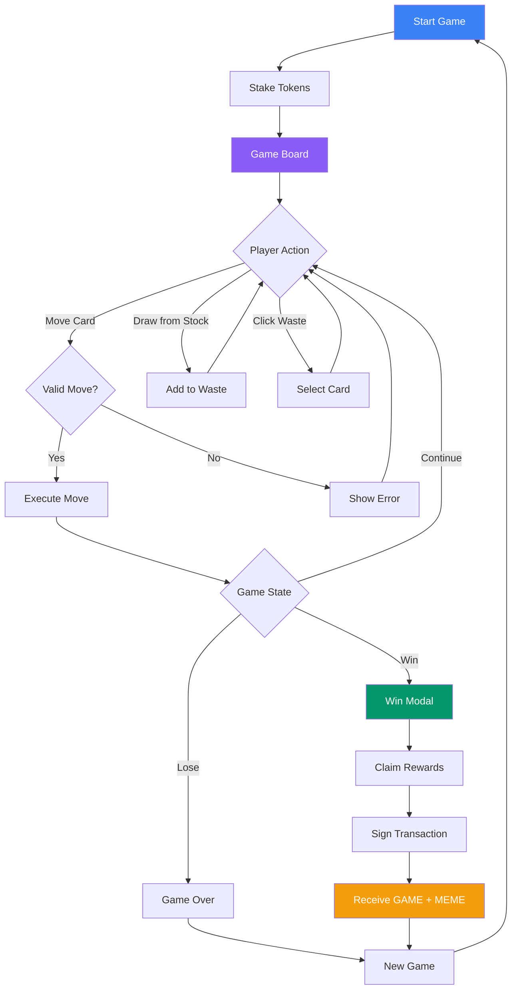

## User Flow: Staking & Rewards

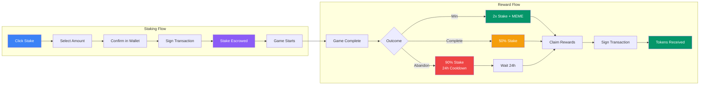

## Game Board Layout

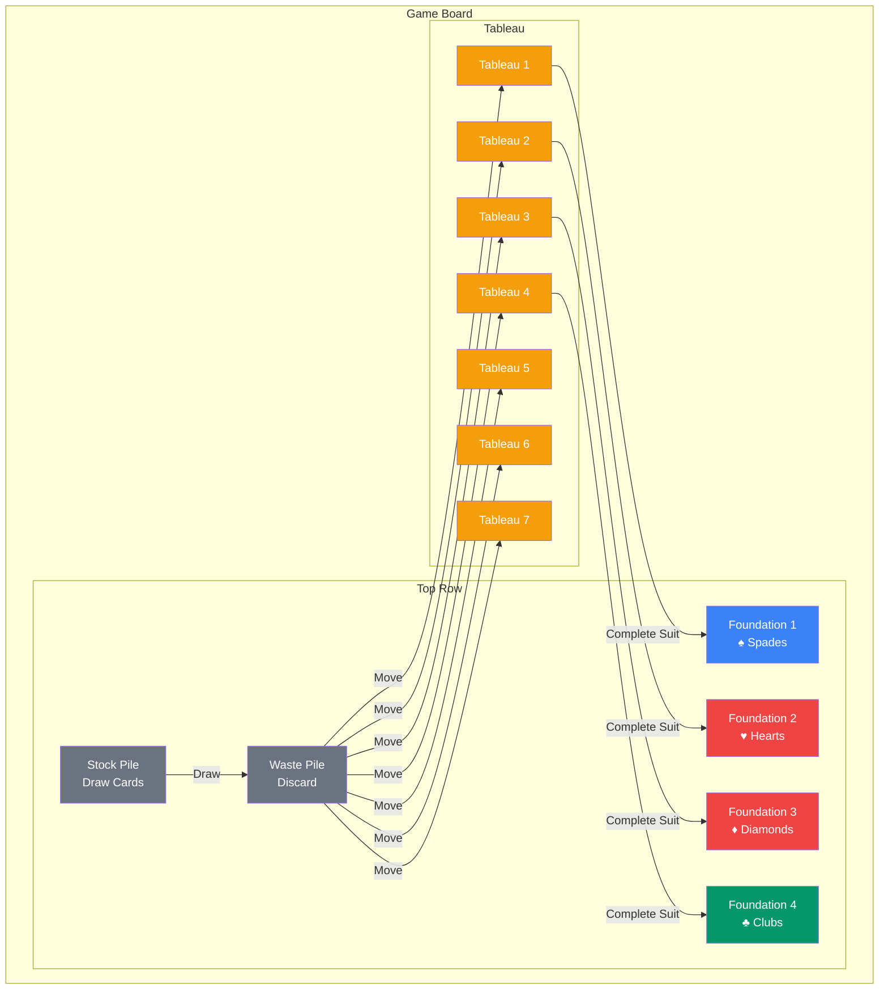

## Data Flow Architecture

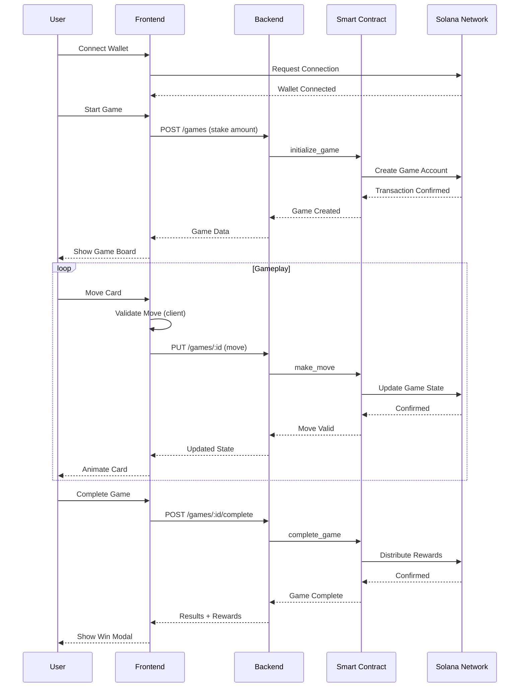

## Feature Status Overview

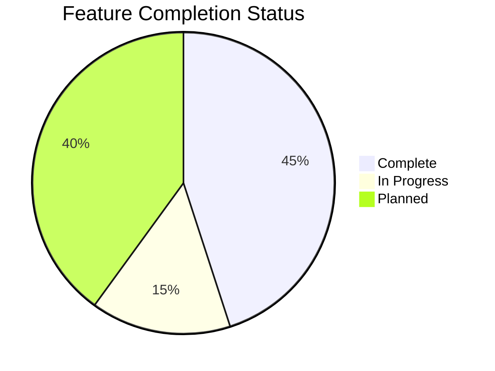

## Component Hierarchy

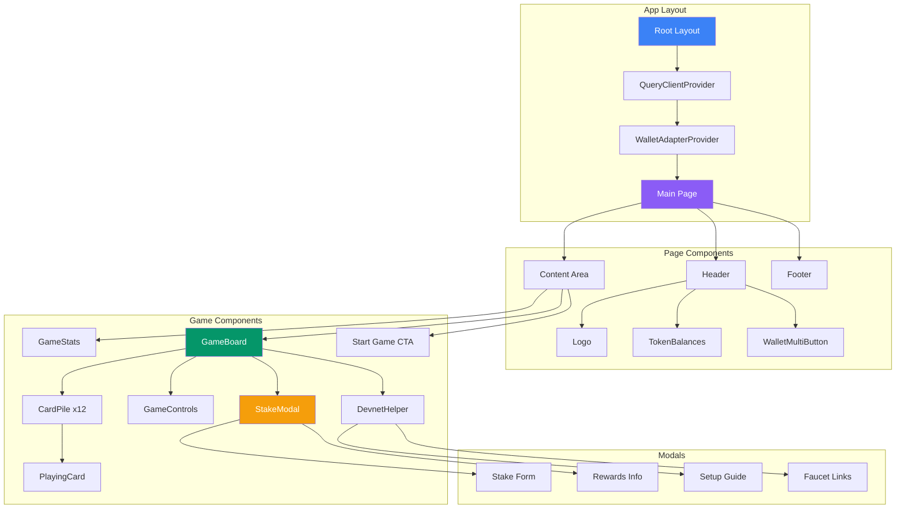

## Token Distribution

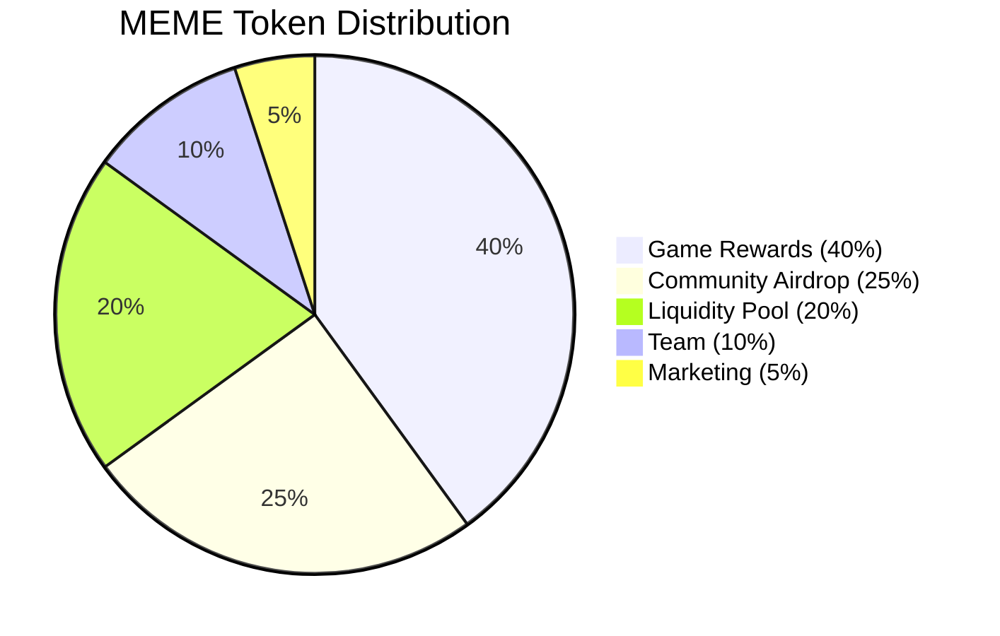

## Leaderboard Structure

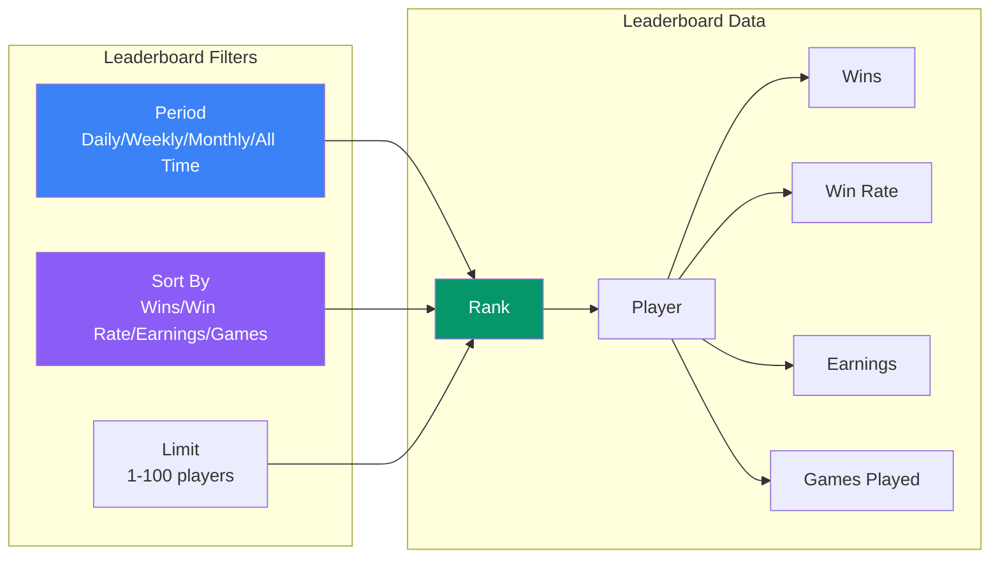

## Security Layers

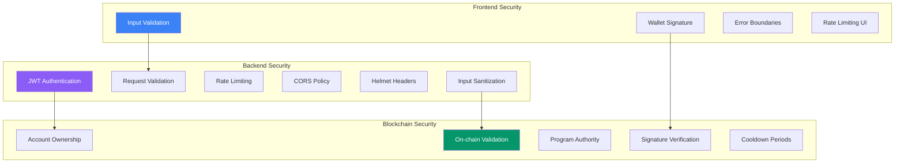

## Deployment Architecture

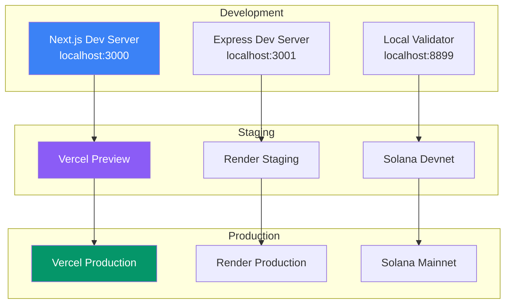

---

*Generated from SITE_MAP.md - 2026-06-23*
