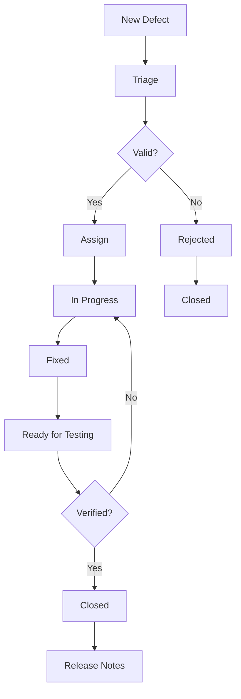

# Comprehensive QA Protocols & Documentation

## Overview
This document provides the complete Quality Assurance protocols for the Solana-based Solitaire game ecosystem, including testing methodologies, quality standards, release procedures, and continuous improvement processes.

## QA Framework Structure

### Quality Gates
```typescript
// qa/quality-gates.ts
export const QualityGates = {
  codeCoverage: {
    minimum: 95,
    critical: 90
  },
  securityScan: {
    maxVulnerabilities: {
      critical: 0,
      high: 0,
      medium: 2,
      low: 5
    }
  },
  performance: {
    maxLoadTime: 3000, // ms
    maxTransactionTime: 10000, // ms
    minLighthouseScore: 90
  },
  accessibility: {
    minA11yScore: 95,
    wcagLevel: 'AA'
  },
  functionality: {
    testPassRate: 100,
    criticalFailures: 0
  }
};
```

### Testing Pyramid
```
    ╭─────────────────╮
    │   E2E Tests     │  ← 10%  (Critical User Journeys)
    ├─────────────────┤
    │ Integration     │  ← 20%  (Component Interactions)
    ├─────────────────┤
    │  Unit Tests     │  ← 70%  (Function-level Testing)
    ╰─────────────────╯
```

## 1. Testing Standards & Procedures

### Code Review Standards
```markdown
## Code Review Checklist

### Functional Requirements
- [ ] Code implements requirements correctly
- [ ] Edge cases are handled appropriately
- [ ] Error handling is comprehensive
- [ ] Business logic is accurate

### Technical Requirements
- [ ] Code follows project style guidelines
- [ ] Functions are appropriately sized
- [ ] Variable naming is clear and consistent
- [ ] Comments explain complex logic
- [ ] No dead code or commented-out code

### Security Requirements
- [ ] Input validation implemented
- [ ] No hardcoded secrets
- [ ] Proper authentication/authorization
- [ ] Safe handling of external data

### Performance Requirements
- [ ] Efficient algorithms used
- [ ] No memory leaks
- [ ] Appropriate caching strategies
- [ ] Database queries optimized

### Testing Requirements
- [ ] Unit tests written for new functions
- [ ] Tests cover edge cases
- [ ] Integration tests included where needed
- [ ] Test documentation is clear
```

### Test Case Management
```typescript
// qa/test-case-management.ts
export class TestCaseManager {
  private testCases: Map<string, TestCase> = new Map();

  createTestCase(testCase: TestCase): string {
    const id = this.generateTestCaseId();
    testCase.id = id;
    testCase.createdAt = new Date();
    testCase.status = 'Draft';

    this.testCases.set(id, testCase);
    return id;
  }

  updateTestCase(id: string, updates: Partial<TestCase>): void {
    const testCase = this.testCases.get(id);
    if (testCase) {
      Object.assign(testCase, updates);
      testCase.updatedAt = new Date();
    }
  }

  executeTestCase(id: string, results: TestExecution): void {
    const testCase = this.testCases.get(id);
    if (testCase) {
      testCase.lastExecution = results;
      testCase.status = results.passed ? 'Passed' : 'Failed';
      testCase.lastExecutedAt = new Date();
    }
  }

  generateTestReport(): TestReport {
    const testCases = Array.from(this.testCases.values());
    const passed = testCases.filter(tc => tc.status === 'Passed').length;
    const failed = testCases.filter(tc => tc.status === 'Failed').length;
    const total = testCases.length;

    return {
      total,
      passed,
      failed,
      passRate: (passed / total) * 100,
      executionTime: this.calculateTotalExecutionTime(testCases),
      coverage: this.calculateCoverage(testCases)
    };
  }
}

interface TestCase {
  id: string;
  title: string;
  description: string;
  preconditions: string[];
  steps: TestStep[];
  expectedResult: string;
  priority: 'Critical' | 'High' | 'Medium' | 'Low';
  category: 'Unit' | 'Integration' | 'E2E' | 'Security' | 'Performance';
  status: 'Draft' | 'Ready' | 'Passed' | 'Failed' | 'Blocked';
  createdAt: Date;
  updatedAt: Date;
  lastExecutedAt?: Date;
  lastExecution?: TestExecution;
}

interface TestStep {
  id: string;
  description: string;
  expected: string;
  actual?: string;
  passed?: boolean;
}
```

## 2. Release Management Procedures

### Release Checklist
```markdown
## Pre-Release Checklist

### Code Quality
- [ ] All unit tests passing (100% pass rate)
- [ ] Code coverage ≥ 95%
- [ ] Integration tests passing
- [ ] E2E tests passing for critical paths
- [ ] Security scan passed (0 critical/high vulnerabilities)
- [ ] Performance benchmarks met
- [ ] Accessibility compliance verified

### Documentation
- [ ] API documentation updated
- [ ] User documentation updated
- [ ] Release notes drafted
- [ ] Migration guide prepared (if needed)
- [ ] Known issues documented

### Deployment Preparation
- [ ] Staging environment testing complete
- [ ] Database migrations tested
- [ ] Configuration validated
- [ ] Rollback plan prepared
- [ ] Monitoring and alerting configured
- [ ] Backup procedures verified

### Business Validation
- [ ] Product owner approval received
- [ ] Marketing materials prepared
- [ ] Support team trained
- [ ] Customer communication planned

## Post-Release Checklist

### Verification
- [ ] Deployment successful
- [ ] Health checks passing
- [ ] Monitoring systems operational
- [ ] Error rates within acceptable limits
- [ ] Performance metrics within SLA

### Communication
- [ ] Release announcement sent
- [ ] Stakeholders notified
- [ ] Support documentation updated
- [ ] Customer feedback collected

### Follow-up
- [ ] Monitor for 24-48 hours post-release
- [ ] Address any issues promptly
- [ ] Document lessons learned
- [ ] Update procedures based on feedback
```

### Release Pipeline Configuration
```yaml
# .github/workflows/release-pipeline.yml
name: Release Pipeline

on:
  push:
    tags:
      - 'v*'

jobs:
  pre-release-checks:
    runs-on: ubuntu-latest
    outputs:
      can-release: ${{ steps.checks.outputs.can-release }}

    steps:
    - uses: actions/checkout@v3

    - name: Setup Node.js
      uses: actions/setup-node@v3
      with:
        node-version: '18'
        cache: 'npm'

    - name: Install dependencies
      run: npm ci

    - name: Run quality checks
      id: checks
      run: |
        echo "Running comprehensive quality checks..."

        # Unit tests
        npm run test:unit
        echo "Unit tests: PASSED" >> $GITHUB_STEP_SUMMARY

        # Integration tests
        npm run test:integration
        echo "Integration tests: PASSED" >> $GITHUB_STEP_SUMMARY

        # E2E tests
        npm run test:e2e
        echo "E2E tests: PASSED" >> $GITHUB_STEP_SUMMARY

        # Security scan
        npm run security:scan
        echo "Security scan: PASSED" >> $GITHUB_STEP_SUMMARY

        # Performance tests
        npm run test:performance
        echo "Performance tests: PASSED" >> $GITHUB_STEP_SUMMARY

        # Coverage check
        COVERAGE=$(npm run test:coverage:check)
        if [ $COVERAGE -lt 95 ]; then
          echo "Coverage below threshold"
          exit 1
        fi

        echo "can-release=true" >> $GITHUB_OUTPUT

  build-and-deploy:
    needs: pre-release-checks
    if: needs.pre-release-checks.outputs.can-release == 'true'
    runs-on: ubuntu-latest

    steps:
    - uses: actions/checkout@v3

    - name: Build application
      run: |
        npm run build
        npm run build:contracts

    - name: Deploy to staging
      run: |
        npm run deploy:staging

    - name: Run smoke tests
      run: |
        npm run test:smoke

    - name: Deploy to production
      run: |
        npm run deploy:production

    - name: Run health checks
      run: |
        npm run health:check

  post-release:
    needs: build-and-deploy
    runs-on: ubuntu-latest

    steps:
    - name: Create GitHub release
      uses: actions/create-release@v1
      env:
        GITHUB_TOKEN: ${{ secrets.GITHUB_TOKEN }}
      with:
        tag_name: ${{ github.ref }}
        release_name: Release ${{ github.ref }}
        draft: false
        prerelease: false

    - name: Notify stakeholders
      run: |
        npm run notify:release
```

## 3. Quality Metrics & Monitoring

### Quality Dashboard Configuration
```typescript
// qa/quality-dashboard.ts
export class QualityDashboard {
  private metrics: QualityMetrics = {
    code: {
      coverage: 0,
      complexity: 0,
      maintainability: 0,
      duplicateCode: 0
    },
    testing: {
      unitTestPassRate: 0,
      integrationTestPassRate: 0,
      e2eTestPassRate: 0,
      securityTestPassRate: 0
    },
    performance: {
      averageLoadTime: 0,
      transactionSuccessRate: 0,
      errorRate: 0,
      uptime: 0
    },
    security: {
      vulnerabilities: {
        critical: 0,
        high: 0,
        medium: 0,
        low: 0
      },
      lastScanDate: new Date()
    }
  };

  async generateQualityReport(): Promise<QualityReport> {
    const report: QualityReport = {
      timestamp: new Date(),
      overallScore: this.calculateOverallScore(),
      metrics: this.metrics,
      trends: await this.calculateTrends(),
      recommendations: this.generateRecommendations(),
      actionItems: this.generateActionItems()
    };

    return report;
  }

  private calculateOverallScore(): number {
    const scores = [
      this.metrics.code.coverage,
      this.metrics.code.maintainability,
      this.metrics.testing.unitTestPassRate,
      this.metrics.testing.integrationTestPassRate,
      this.metrics.performance.transactionSuccessRate,
      this.getSecurityScore()
    ];

    return scores.reduce((a, b) => a + b) / scores.length;
  }

  private getSecurityScore(): number {
    const vulns = this.metrics.security.vulnerabilities;
    const totalVulns = vulns.critical + vulns.high + vulns.medium + vulns.low;

    if (vulns.critical > 0 || vulns.high > 0) return 0;
    if (totalVulns === 0) return 100;

    return Math.max(0, 100 - (totalVulns * 10));
  }

  generateRecommendations(): Recommendation[] {
    const recommendations: Recommendation[] = [];

    if (this.metrics.code.coverage < 95) {
      recommendations.push({
        category: 'Testing',
        priority: 'High',
        title: 'Increase Code Coverage',
        description: `Current coverage is ${this.metrics.code.coverage}%. Target is 95%+`,
        action: 'Add unit tests for uncovered code paths'
      });
    }

    if (this.metrics.security.vulnerabilities.critical > 0) {
      recommendations.push({
        category: 'Security',
        priority: 'Critical',
        title: 'Fix Critical Vulnerabilities',
        description: `${this.metrics.security.vulnerabilities.critical} critical vulnerabilities found`,
        action: 'Address all critical security issues immediately'
      });
    }

    return recommendations;
  }
}

interface QualityMetrics {
  code: {
    coverage: number;
    complexity: number;
    maintainability: number;
    duplicateCode: number;
  };
  testing: {
    unitTestPassRate: number;
    integrationTestPassRate: number;
    e2eTestPassRate: number;
    securityTestPassRate: number;
  };
  performance: {
    averageLoadTime: number;
    transactionSuccessRate: number;
    errorRate: number;
    uptime: number;
  };
  security: {
    vulnerabilities: {
      critical: number;
      high: number;
      medium: number;
      low: number;
    };
    lastScanDate: Date;
  };
}
```

### Continuous Monitoring Setup
```typescript
// monitoring/quality-monitor.ts
export class QualityMonitor {
  private alerts: Alert[] = [];

  async startMonitoring(): Promise<void> {
    // Monitor code quality metrics
    this.scheduleCodeQualityChecks();

    // Monitor test results
    this.scheduleTestMonitoring();

    // Monitor performance metrics
    this.schedulePerformanceMonitoring();

    // Monitor security scans
    this.scheduleSecurityMonitoring();
  }

  private scheduleCodeQualityChecks(): void {
    setInterval(async () => {
      const metrics = await this.getCodeQualityMetrics();

      if (metrics.coverage < 90) {
        this.createAlert({
          type: 'Quality',
          severity: 'Warning',
          message: `Code coverage dropped to ${metrics.coverage}%`,
          action: 'Review recent changes and add tests'
        });
      }

      if (metrics.complexity > 10) {
        this.createAlert({
          type: 'Quality',
          severity: 'Warning',
          message: `Code complexity increased to ${metrics.complexity}`,
          action: 'Refactor complex functions'
        });
      }
    }, 24 * 60 * 60 * 1000); // Daily
  }

  private scheduleTestMonitoring(): void {
    // Monitor CI/CD test results
    // Alert on test failures
    // Track test execution time trends
  }

  private schedulePerformanceMonitoring(): void {
    // Monitor application performance
    // Alert on performance degradation
    // Track SLA compliance
  }

  private scheduleSecurityMonitoring(): void {
    // Schedule regular security scans
    // Monitor for new vulnerabilities
    // Alert on security issues
  }

  private createAlert(alert: Alert): void {
    this.alerts.push(alert);
    this.notifyTeam(alert);
    this.logAlert(alert);
  }

  private notifyTeam(alert: Alert): void {
    // Send notifications via Slack, email, etc.
  }
}
```

## 4. Test Environment Management

### Environment Configuration
```yaml
# environments/test-environments.yml
environments:
  local:
    name: "Local Development"
    type: "development"
    database: "sqlite"
    blockchain: "local-validator"
    features:
      - hot-reload
      - debug-mode
      - mock-data

  staging:
    name: "Staging Environment"
    type: "staging"
    database: "postgresql"
    blockchain: "devnet"
    features:
      - full-featured
      - test-data
      - monitoring-enabled

  production:
    name: "Production Environment"
    type: "production"
    database: "postgresql-cluster"
    blockchain: "mainnet"
    features:
      - full-featured
      - high-availability
      - extensive-monitoring

test-data:
  fixtures:
    - users: 100
    - games: 500
    - transactions: 10000

  scenarios:
    - name: "New User Journey"
      users: 1
      games_per_user: 1
      duration: "5 minutes"

    - name: "High Volume Trading"
      users: 50
      games_per_user: 10
      duration: "30 minutes"

    - name: "Stress Test"
      users: 1000
      games_per_user: 5
      duration: "1 hour"
```

### Test Data Management
```typescript
// qa/test-data-manager.ts
export class TestDataManager {
  private dataGenerators: Map<string, DataGenerator> = new Map();

  constructor() {
    this.registerDataGenerators();
  }

  async generateTestData(scenario: TestScenario): Promise<TestData> {
    const testData: TestData = {
      users: [],
      games: [],
      transactions: [],
      metadata: {
        scenario: scenario.name,
        generatedAt: new Date(),
        version: '1.0'
      }
    };

    // Generate users
    for (let i = 0; i < scenario.userCount; i++) {
      const user = await this.generateUser(`user-${i}`);
      testData.users.push(user);
    }

    // Generate games
    for (const user of testData.users) {
      for (let i = 0; i < scenario.gamesPerUser; i++) {
        const game = await this.generateGame(user);
        testData.games.push(game);
      }
    }

    // Generate transactions
    for (const game of testData.games) {
      const transactions = await this.generateTransactions(game, scenario.duration);
      testData.transactions.push(...transactions);
    }

    return testData;
  }

  async cleanupTestData(testData: TestData): Promise<void> {
    // Clean up generated test data
    for (const user of testData.users) {
      await this.deleteUser(user.id);
    }
  }

  private async generateUser(identifier: string): Promise<TestUser> {
    return {
      id: generateId(),
      walletAddress: generateWalletAddress(),
      username: `test_${identifier}`,
      email: `${identifier}@test.com`,
      createdAt: new Date(),
      tokenBalance: 1000,
      memeBalance: 500
    };
  }

  private async generateGame(user: TestUser): Promise<TestGame> {
    return {
      id: generateId(),
      userId: user.id,
      status: 'active',
      startedAt: new Date(),
      stakeAmount: Math.floor(Math.random() * 100) + 10,
      moves: 0,
      score: 0,
      boardState: generateRandomBoardState()
    };
  }
}
```

## 5. Defect Management Process

### Defect Lifecycle


### Defect Classification System
```typescript
// qa/defect-classification.ts
export enum DefectSeverity {
  Critical = 'Critical',
  High = 'High',
  Medium = 'Medium',
  Low = 'Low'
}

export enum DefectPriority {
  Immediate = 'Immediate',
  High = 'High',
  Medium = 'Medium',
  Low = 'Low'
}

export enum DefectType {
  Functional = 'Functional',
  Performance = 'Performance',
  Security = 'Security',
  UI = 'UI',
  Compatibility = 'Compatibility',
  Documentation = 'Documentation'
}

export class DefectManager {
  private defects: Map<string, Defect> = new Map();

  createDefect(defect: CreateDefectRequest): string {
    const id = this.generateDefectId();
    const newDefect: Defect = {
      id,
      ...defect,
      status: 'New',
      createdAt: new Date(),
      createdBy: defect.reporter
    };

    this.defects.set(id, newDefect);
    this.notifyTeam(newDefect);
    return id;
  }

  updateDefect(id: string, updates: UpdateDefectRequest): void {
    const defect = this.defects.get(id);
    if (defect) {
      Object.assign(defect, updates);
      defect.updatedAt = new Date();
      defect.updatedBy = updates.updatedBy;

      if (updates.status) {
        this.handleStatusChange(defect, updates.status);
      }
    }
  }

  private handleStatusChange(defect: Defect, newStatus: string): void {
    switch (newStatus) {
      case 'Assigned':
        this.notifyAssignee(defect);
        break;
      case 'Fixed':
        this.notifyQA(defect);
        break;
      case 'Verified':
        this.scheduleForRelease(defect);
        break;
      case 'Closed':
        this.createKnowledgeBaseEntry(defect);
        break;
    }
  }

  generateDefectReport(): DefectReport {
    const defects = Array.from(this.defects.values());

    return {
      total: defects.length,
      byStatus: this.groupByStatus(defects),
      bySeverity: this.groupBySeverity(defects),
      byType: this.groupByType(defects),
      resolutionTime: this.calculateAverageResolutionTime(defects),
      trends: this.calculateDefectTrends(defects)
    };
  }
}
```

## 6. Continuous Improvement Process

### Quality Improvement Workflow
```typescript
// qa/quality-improvement.ts
export class QualityImprovement {
  private improvementActions: ImprovementAction[] = [];

  async analyzeQualityMetrics(): Promise<ImprovementPlan> {
    const metrics = await this.collectQualityMetrics();
    const analysis = await this.analyzeMetrics(metrics);
    const actions = this.generateImprovementActions(analysis);

    return {
      currentMetrics: metrics,
      analysis,
      actions,
      timeline: this.createImplementationTimeline(actions),
      expectedOutcomes: this.predictOutcomes(actions)
    };
  }

  private async collectQualityMetrics(): Promise<QualityMetrics> {
    // Collect metrics from various sources
    return {
      codeMetrics: await this.getCodeMetrics(),
      testMetrics: await this.getTestMetrics(),
      performanceMetrics: await this.getPerformanceMetrics(),
      securityMetrics: await this.getSecurityMetrics(),
      userFeedback: await this.getUserFeedback()
    };
  }

  private generateImprovementActions(analysis: QualityAnalysis): ImprovementAction[] {
    const actions: ImprovementAction[] = [];

    if (analysis.codeCoverage < 95) {
      actions.push({
        id: generateId(),
        title: 'Improve Code Coverage',
        description: `Increase code coverage from ${analysis.codeCoverage}% to 95%`,
        priority: 'High',
        category: 'Testing',
        estimatedEffort: '2 weeks',
        owner: 'QA Team',
        status: 'Planned'
      });
    }

    if (analysis.securityVulnerabilities > 0) {
      actions.push({
        id: generateId(),
        title: 'Address Security Vulnerabilities',
        description: `Fix ${analysis.securityVulnerabilities} security issues`,
        priority: 'Critical',
        category: 'Security',
        estimatedEffort: '1 week',
        owner: 'Security Team',
        status: 'Planned'
      });
    }

    return actions;
  }

  async implementImprovementActions(): Promise<void> {
    for (const action of this.improvementActions) {
      if (action.status === 'Approved') {
        await this.executeAction(action);
        await this.measureActionImpact(action);
        await this.updateKnowledgeBase(action);
      }
    }
  }
}
```

### Knowledge Base Management
```typescript
// qa/knowledge-base.ts
export class QualityKnowledgeBase {
  private articles: Map<string, KnowledgeArticle> = new Map();
  private patterns: Map<string, TestPattern> = new Map();

  createArticle(article: CreateArticleRequest): string {
    const id = generateId();
    const newArticle: KnowledgeArticle = {
      id,
      ...article,
      createdAt: new Date(),
      status: 'Draft'
    };

    this.articles.set(id, newArticle);
    return id;
  }

  searchArticles(query: string): KnowledgeArticle[] {
    const results: KnowledgeArticle[] = [];

    for (const article of this.articles.values()) {
      if (this.matchesQuery(article, query)) {
        results.push(article);
      }
    }

    return results.sort((a, b) => b.relevanceScore - a.relevanceScore);
  }

  recordTestPattern(pattern: TestPattern): void {
    this.patterns.set(pattern.id, pattern);
  }

  generateTestRecommendations(scenario: TestScenario): TestRecommendation[] {
    const recommendations: TestRecommendation[] = [];

    // Find relevant patterns
    for (const pattern of this.patterns.values()) {
      if (this.isPatternApplicable(pattern, scenario)) {
        recommendations.push({
          patternId: pattern.id,
          description: pattern.description,
          testCases: pattern.testCases,
          priority: pattern.priority
        });
      }
    }

    return recommendations;
  }
}
```

## QA Team Roles & Responsibilities

### Quality Assurance Team Structure
```typescript
// qa/team-structure.ts
export interface QATeamRole {
  id: string;
  title: string;
  responsibilities: string[];
  requiredSkills: string[];
  certifications?: string[];
}

export const qaRoles: QATeamRole[] = [
  {
    id: 'qa-lead',
    title: 'QA Lead',
    responsibilities: [
      'Define testing strategies and methodologies',
      'Manage QA team and resource allocation',
      'Coordinate with development and product teams',
      'Oversee quality metrics and reporting',
      'Drive continuous improvement initiatives'
    ],
    requiredSkills: [
      'Test Management',
      'Team Leadership',
      'Quality Metrics',
      'Agile Methodologies',
      'Communication Skills'
    ],
    certifications: ['ISTQB Advanced Level', 'CSTE']
  },
  {
    id: 'test-architect',
    title: 'Test Architect',
    responsibilities: [
      'Design test frameworks and automation strategies',
      'Define testing standards and best practices',
      'Evaluate and select testing tools',
      'Mentor team on technical testing approaches',
      'Ensure test infrastructure scalability'
    ],
    requiredSkills: [
      'Test Automation',
      'Framework Design',
      'Performance Testing',
      'Security Testing',
      'Cloud Technologies'
    ],
    certifications: ['ISTQB Technical Test Analyst', 'Performance Testing Certification']
  },
  {
    id: 'automation-engineer',
    title: 'Test Automation Engineer',
    responsibilities: [
      'Develop and maintain automated test scripts',
      'Integrate tests into CI/CD pipelines',
      'Monitor test execution and results',
      'Troubleshoot test failures',
      'Optimize test execution performance'
    ],
    requiredSkills: [
      'Programming Languages (TypeScript, Rust)',
      'Test Automation Frameworks',
      'CI/CD Tools',
      'Version Control',
      'Debugging Skills'
    ]
  },
  {
    id: 'manual-tester',
    title: 'Manual QA Tester',
    responsibilities: [
      'Execute exploratory testing',
      'Perform usability and accessibility testing',
      'Create and execute test cases',
      'Document defects with detailed information',
      'Perform regression testing'
    ],
    requiredSkills: [
      'Test Case Design',
      'Exploratory Testing',
      'Usability Testing',
      'Defect Reporting',
      'Domain Knowledge'
    ],
    certifications: ['ISTQB Foundation Level']
  },
  {
    id: 'security-tester',
    title: 'Security Tester',
    responsibilities: [
      'Perform security assessments and penetration testing',
      'Identify vulnerabilities in application and infrastructure',
      'Review code for security issues',
      'Conduct security training for development team',
      'Monitor security threats and advisories'
    ],
    requiredSkills: [
      'Security Testing',
      'Penetration Testing',
      'Vulnerability Assessment',
      'Secure Coding Practices',
      'Compliance Knowledge'
    ],
    certifications: ['CEH', 'OSCP', 'CISSP']
  }
];
```

## Training & Development Program

### QA Team Training Curriculum
```markdown
## QA Team Training Program

### Foundations (Week 1-2)
- **Testing Fundamentals**
  - Testing principles and methodologies
  - Test planning and design
  - Defect lifecycle management
  - Quality metrics and reporting

- **Domain Knowledge**
  - Blockchain and Solana basics
  - Smart contract fundamentals
  - Web3 wallet integration
  - Gaming industry knowledge

### Technical Skills (Week 3-6)
- **Test Automation**
  - JavaScript/TypeScript for testing
  - Playwright for E2E testing
  - Jest for unit testing
  - Smart contract testing frameworks

- **Performance Testing**
  - Load testing methodologies
  - Performance monitoring tools
  - Blockchain performance analysis
  - Scalability testing

### Security Testing (Week 7-8)
- **Security Fundamentals**
  - OWASP security testing
  - Smart contract security
  - Web3 security best practices
  - Penetration testing basics

### Advanced Topics (Week 9-12)
- **DevOps & CI/CD**
  - Continuous integration testing
  - Pipeline security scanning
  - Infrastructure as Code testing
  - Monitoring and alerting

- **Leadership & Communication**
  - Agile methodologies
  - Stakeholder communication
  - Team collaboration
  - Quality advocacy
```

## Success Metrics & KPIs

### QA Team Performance Metrics
```typescript
// qa/performance-metrics.ts
export const QAPerformanceMetrics = {
  effectiveness: {
    defectDetectionRate: 'Percentage of defects found before production',
    defectRemovalEfficiency: 'Percentage of defects removed in same phase',
    testCoverage: 'Code coverage achieved by tests',
    testExecutionTime: 'Time taken to execute test suites'
  },

  efficiency: {
    testAutomationRate: 'Percentage of tests automated',
    testExecutionFrequency: 'Number of test cycles per day',
    defectFixTime: 'Average time to fix defects',
    releaseFrequency: 'Number of releases per month'
  },

  quality: {
    productionDefectRate: 'Defects found in production',
    customerSatisfactionScore: 'CSAT related to quality',
    uptime: 'Application availability percentage',
    performanceScore: 'Application performance ratings'
  },

  innovation: {
    newToolsAdopted: 'Number of new testing tools implemented',
    processImprovements: 'Process improvements implemented',
    knowledgeSharing: 'Knowledge base articles created',
    trainingCompletion: 'Training programs completed'
  }
};
```

## Implementation Timeline

### QA Implementation Roadmap
```markdown
## Phase 1: Foundation Setup (Weeks 1-4)
- [x] Testing framework selection and setup
- [x] CI/CD pipeline integration
- [x] Quality gates definition
- [x] Team structure definition
- [x] Documentation templates

## Phase 2: Test Development (Weeks 5-8)
- [ ] Unit test implementation
- [ ] Integration test development
- [ ] E2E test automation
- [ ] Security testing setup
- [ ] Performance testing framework

## Phase 3: Process Implementation (Weeks 9-12)
- [ ] Defect management process
- [ ] Release management procedures
- [ ] Quality monitoring setup
- [ ] Team training program
- [ ] Knowledge base creation

## Phase 4: Optimization (Weeks 13-16)
- [ ] Process optimization
- [ ] Tool enhancement
- [ ] Metrics refinement
- [ ] Continuous improvement cycle
- [ ] Success measurement

## Phase 5: Maturity (Ongoing)
- [ ] Advanced testing techniques
- [ ] AI/ML in testing
- [ ] Predictive quality analytics
- [ ] Innovation projects
- [ ] Industry best practices
```

This comprehensive QA documentation provides the foundation for maintaining high-quality standards throughout the development lifecycle of the Solana Solitaire game ecosystem. The protocols ensure consistent quality delivery, continuous improvement, and alignment with industry best practices.